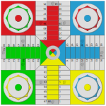

# libparchis c++

&nbsp;

&nbsp;

Este proyecto consiste en la librería C++ del juego del Parchis. La he subido como proyecto open source en Febrero de 2024.

¿Qué es el Parchis?... pues un juego de mesa, que también se conoce como Pachisi, Parchisi, Parchesi o Veinticinco. Se trata de una adaptación del juego indio de la cruz y el círculo *Pachisi*. Creado en la India alrededor del año 500 a.C., el juego suele subtitularse Juego Real de la India porque supuestamente la realeza jugaba utilizando bailarines disfrazados como piezas en grandes tableros al aire libre (se conserva un tablero de este tipo en Fatehpur Sikri).

Empecé a desarrollar El Parchis en 1995 para aprender Visual Basic, luego lo rehice en Java, después lo volví a hacer en C++ (aquí es donde creé la primera versión de esta librería), más adelante he creado versiones del fronted (gui) en Qt, Objective-C y la última en Swift y un intento en OpenGL.

&nbsp;

&nbsp;

Para mi ha constituido un proyecto de aprendizaje de programación. Siempre es más fácil aprender un lenguaje nuevo cuando tienes un objetivo en mente.

La parte frontend no la he subido a GitHub..., de momento.

&nbsp;

&nbsp;

---

<a property="dct:title" rel="cc:attributionURL" href="https://github.com/LuisPalacios/cpp-libparchis">Librería juego del Parchis en C++</a> © 2024 por <a rel="cc:attributionURL dct:creator" property="cc:attributionName" href="https://www.luispa.com/about/">Luis Palacios Derqui</a> licenciada bajo <a href="http://creativecommons.org/licenses/by-nc-nd/4.0/deed.es/?ref=chooser-v1" target="_blank" rel="license noopener noreferrer" style="display:inline-block;">CC BY-NC-ND 4.0</a>

